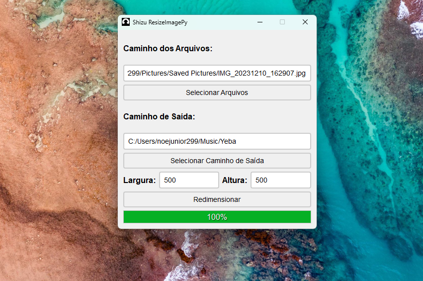

# ShizuRenderImage (SRI)

## Descrição

O ResizeMaster é um software open-source desenvolvido para redimensionar centenas de imagens de uma vez só. Com uma interface intuitiva e fácil de usar, o ResizeMaster permite que qualquer pessoa, desde fotógrafos amadores até profissionais de design gráfico, redimensione suas imagens com rapidez e eficiência.

- Redimensiona imagens para o tamanho desejado
- Quase sem perda de qualidade de imagens
- Software seguro e open-source
- Simples e fácil de usar

## Instalar

- **Baixar o repositório**
- **Instale dependências usando pip**: `pip install -r requirements.txt`
- **Execute** `main.py`

## Contribuição

Basta enviar uma mensagem direta para [@shizu_ankai_722](https://www.instagram.com/shizu_ankai_722) ou para [Noé Júnior](https://www.instagram.com/noejunior299) no Instagram e nos contar como você gostaria de contribuir. Seja participando do nosso projeto no GitHub ou compartilhando suas opiniões e sugestões, adoraríamos ouvir de você!

## Contato

- **Shizu Ankai** > [@shizu_ankai_722](https://www.instagram.com/shizu_ankai_722) no Instagram
- **Noé Júnior** > [@noejunior299](https://www.linkedin.com/in/no%C3%A9-j%C3%BAnior-402569307/) no Linkedin

## Autores e Créditos

- **Shizu Ankai** > MG Brasil - Software Engineer
- **Noé Júnior** > Angola - Software Engineer
